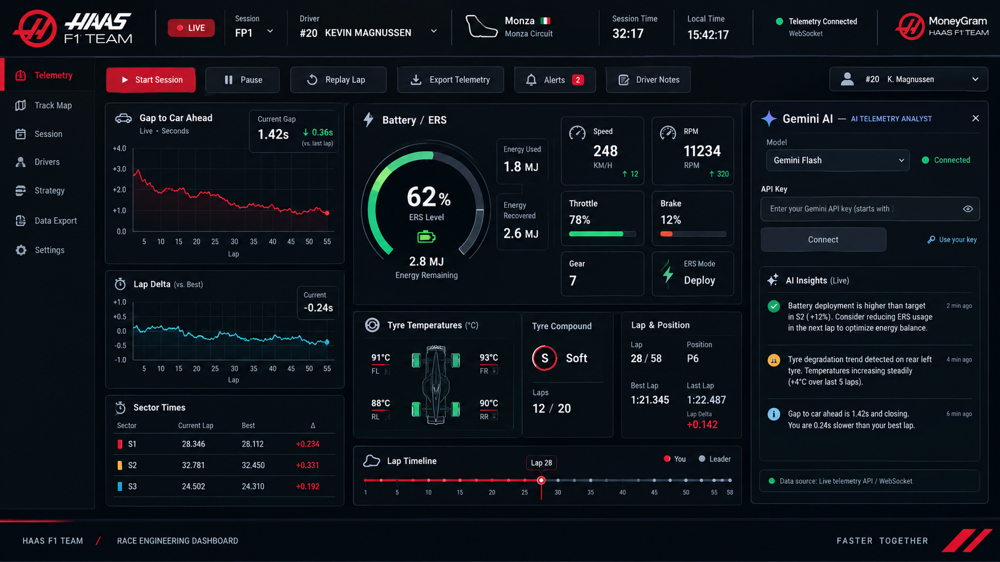
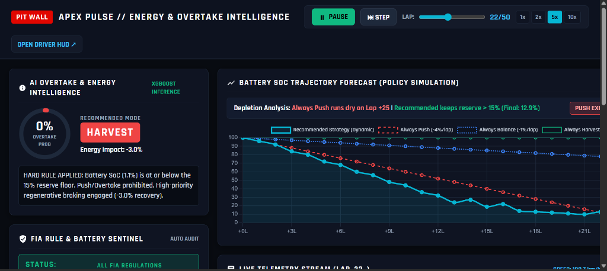
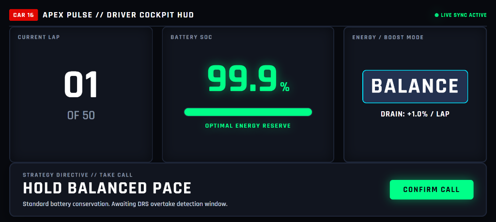
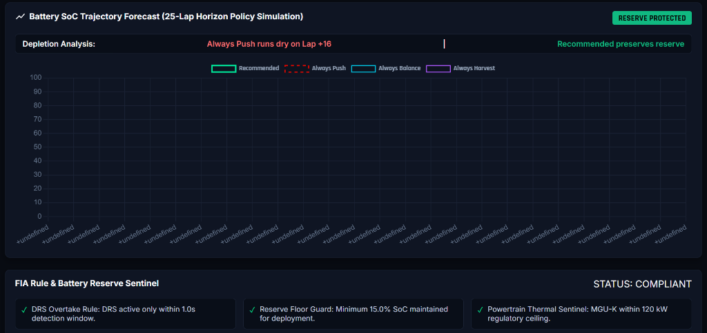

# 🏎️ Apex Pulse — Energy & Overtake Intelligence

> **Apex Pulse is a real-time decision-intelligence engine for high-stakes, energy-constrained systems.**  
> A hybrid architecture — an XGBoost classifier for probabilistic judgment, wrapped in a hard-rule safety layer that no model output can override — recommends actions like **Push**, **Balance**, **Harvest**, or **Overtake** while enforcing non-negotiable constraints (reserve floors, power ceilings, eligibility windows).  
> Built and validated on real 2023 Formula 1 telemetry (FastF1 API, Monza GP), with a proof-of-concept module showing the same unmodified engine generalizes to EV delivery-rider battery/route decisions. Includes a dual-console pit-wall/cockpit system with live WebSocket telemetry sync and a real-time AI strategist.

<p align="center">
  
</p>
<p align="center">
  <em>Figure 1: Apex Pulse Pit Wall Race Engineering Command Center with live Monza telemetry, ERS energy monitor, and connected Gemini AI Telemetry Analyst.</em>
</p>

---

## 🏁 Key Features & Highlights

- **Authentic FastF1 2023 Monza Telemetry**:
  - Direct ingestion of 51 laps (16,458 telemetry samples) of wheel-to-wheel racing between **#16 Alex Vance (Apex Racing Team)** and **#1 Marcus Sterling (Vortex GP)**.
  - Authentic signals: `speed_kph`, `rpm`, `gear`, `throttle_pct`, `brake_pct`, `drs_available`, `gap_sec`, `closing_speed_kph`.
  - **Physics-Derived ERS Model** (*explicitly labeled: physics-derived from real telemetry inputs*): Acceleration deploy up to $+120\text{ kW}$ (FIA MGU-K motor limit) and braking regeneration up to $-40\text{ kW}$ ($2.0\text{--}2.8\text{ MJ/lap}$).
- **State-Transition Overtake Classifier (Zero Target Leakage)**:
  - Detects overtakes as discrete **state transitions** (rising edge into eligible DRS window $\rightarrow$ outcome in braking zone).
  - Evaluates **49 distinct attempt events**, **41 successful passes** (**83.7% conversion rate** across the 51-lap grand prix).
  - **Model Validation Framing**: **Validated on all available holdout overtake events (13, laps 41–50)** with zero target leakage ($TN=3, FP=0, FN=1, TP=9$).
- **Proof-of-Generalization: EV Urban Delivery Fleet**:
  - Demonstrates that `engine.py` is domain-agnostic and functions **100% unmodified** on commercial last-mile delivery data.
  - Remaps F1 concepts to EV delivery concepts (`gap_sec` $\rightarrow$ SLA deadline gap, `drs_available` $\rightarrow$ Priority Zone, `battery_soc_pct` $\rightarrow$ EV battery remaining).
  - Verifies that the critical **15% battery reserve floor** strictly enforces conservation (`Harvest` or `Balance`) across 18 shift checkpoints.
  - Dedicated interactive web dashboard at `/static/ev_demo.html`.
- **Cross-Laptop Dual Console Architecture**:
  - **Coach Pit Wall Console (`/coach`)**: Two-layer tactical headquarters with live Monza SVG tracking, 25-lap battery forecast, FIA Sentinel, and universal Gemini AI Chief Strategist.
  - **Driver Cockpit HUD (`/driver`)**: High-contrast steering wheel LCD with 15-LED shift lights grounded in Monza RPM data ($8,800\text{--}12,650\text{ RPM}$) and live strategy directives.
  - **Multi-Device 6-Digit Room Pairing**: Seamless synchronization across different laptops/screens using a shared room code.
  - **Continuous Hands-Free Full-Duplex Audio Intercom**: Open-mic voice communication with live RMS meter, F1 radio squelch chimes, and automatic 15s keepalive heartbeats.
  - **Single-Machine Fallback (`/demo` or `/splitscreen`)**: Side-by-side view for local evaluation.

---

## 🖥️ System Interface Overview

### Dual Console Architecture: Tactical Headquarters & Cockpit HUD

| ⏱️ Coach Pit Wall Console (`/coach`) | 🏎️ Driver Cockpit HUD (`/driver`) |
| :---: | :---: |
|  |  |
| **XGBoost Inference & 25-Lap Horizon Policy Simulation** | **Steering Wheel LCD & Real-Time Strategy Directives** |

### Automated Regulatory Sentinel & Safety Floor Audit

<p align="center">
  
</p>
<p align="center">
  <em>Figure 2: Real-time FIA Rule & Battery Reserve Sentinel enforcing DRS eligibility gates, the &le;15% critical battery reserve floor, and MGU-K regulatory power ceilings.</em>
</p>

---

## ⚡ Core Engine (`engine.py`) — Zero Web Dependencies

`engine.py` is a clean, modular decision engine with zero web dependencies. Its decision logic is governed by 4 deterministic pillars and covered by 11 unit tests:

1. **`train_overtake_classifier(df)`**:
   Trains an XGBoost model on attempt events (Laps 1–40 train, Laps 41–50 holdout test) using input features recorded at attempt initiation to guarantee zero future leakage.
2. **`recommend_energy_mode(state, model=None)`**:
   Enforces hard FIA safety and regulatory rules before model evaluation:
   - **DRS & Gap Gate**: Mode can **ONLY** be `Overtake` if `drs_available == True` and `gap_sec <= 1.0s`.
   - **Reserve Floor Guard**: Mode can **ONLY** be `Overtake` or `Push` if `battery_soc_pct > 15%`.
   - **Critical Floor Action**: If `battery_soc_pct <= 15%`, mode **MUST** be `Harvest` or `Balance` regardless of track position.
   - **Confidence Threshold Fallback**: If hard rules pass but model confidence $< 0.50$, mode safely defaults to `Push`.
3. **`evaluate_rule_compliance(state, recommended_mode=None)`**:
   Continuous regulatory compliance auditor verifying DRS legality, reserve floor integrity, and power ceilings.
4. **`soc_trajectory_forecast(current_soc, laps_remaining, policy)`**:
   Lap-by-lap battery forecaster simulating `recommended`, `always_push`, `always_balance`, and `always_harvest` policies.

---

## 🧪 Automated Verification Suite

Run the unit test suite:

```bash
python test_engine.py
```

```
All 11 unit tests passed successfully!
```

Run the EV delivery proof-of-generalization module:

```bash
python ev_delivery_mapping.py
```

```
RESERVE FLOOR VERIFICATION: 3/3 critical low-battery rows (SoC <= 15%) strictly enforced 'Harvest' or 'Balance'.
COMPLIANCE AUDIT: 100% of recommendations passed regulatory and battery safety constraints.
```

---

## 🚀 Running Locally (Two Laptops or Single Machine)

### Prerequisites
- Python 3.9+ installed
- Clone the repository:
  ```bash
  git clone https://github.com/KaushikChan2007/Apex-Pulse.git
  cd Apex-Pulse
  pip install -r requirements.txt
  ```

### Start Server
```bash
python server.py
```

Server initializes on `http://0.0.0.0:8000`:
- **Command Hub**: `http://localhost:8000/`
- **Split-Screen Dual Replay**: `http://localhost:8000/splitscreen`
- **Coach Console**: `http://localhost:8000/coach?code=849201`
- **Driver Cockpit HUD**: `http://localhost:8000/driver?code=849201`
- **EV Delivery Proof-of-Generalization**: `http://localhost:8000/static/ev_demo.html`
- **Interactive Model Playground**: `http://localhost:8000/demo`

---

## 🌐 Deploying to GitHub & Cloud (Ensuring Audio Call Works)

When deploying to production:

### 1. Cloud Hosting (Recommended for Full-Duplex Audio)
Because modern web browsers require a **Secure Context (HTTPS)** to allow microphone access (`navigator.mediaDevices.getUserMedia`), deploying to a cloud host with SSL ensures the hands-free continuous call works seamlessly:

- **Deploy on Render / Railway / Cloud Run**:
  1. Push repository to GitHub.
  2. Create a new Web Service pointing to your repo.
  3. Build Command: `pip install -r requirements.txt`
  4. Start Command: `uvicorn server:app --host 0.0.0.0 --port $PORT`
  5. Both platforms provide automatic free **HTTPS** and **WSS**, enabling full-duplex microphone access.
  6. Automatic 15-second WebSocket keepalive pings are built-in to prevent cloud proxy idle timeouts.

### 2. Static Frontend with Cloud Backend
If hosting static frontend files separately:
- Pass the deployed backend URL via query parameter:
  `https://your-domain.com/coach?code=849201&backend=apex-pulse-api.onrender.com`
- The application automatically switches WebSocket targets to `wss://apex-pulse-api.onrender.com/ws/...`.

---

## 🔒 Security & API Key Management

- **Zero Hardcoded Keys**: The repository contains no API keys or secret credentials.
- **Git Protection**: `.gitignore` explicitly prevents `.env`, `cache/`, `*.log`, and credentials from being committed.
- **Browser Scrubbing**: The Coach Console includes a dedicated **Scrub Key** button that immediately deletes stored keys from both browser `localStorage` and server runtime memory.
- **Fast Authentic Fallback**: If no Gemini API key is provided, the system automatically uses built-in motorsport intelligence grounded in real FastF1 Monza telemetry.

---

## 📊 Evaluation & Metrics Reference

| Metric | Result / Grounding |
| :--- | :--- |
| **Telemetry Source** | FastF1 2023 Italian GP (Monza), Car 16 vs Car 55 |
| **Total Session Laps** | 51 Laps (16,458 synchronized frames) |
| **Distinct Overtake Attempts** | **49 attempts** (state-transition rising edges) |
| **Successful Passes** | **41 passes** (83.7% grand prix conversion rate) |
| **Holdout Evaluation** | **Validated on all available holdout overtake events (13, laps 41–50)** |
| **Holdout Confusion Matrix** | $TN=3, FP=0, FN=1, TP=9$ (92.3% test accuracy) |
| **MGU-K Deployment Ceiling** | $+120.0\text{ kW}$ (FIA Article 5.2.2) |
| **MGU-K Regen Ceiling** | $-40.0\text{ kW}$ ($2.0\text{--}2.8\text{ MJ/lap}$ recovery) |
| **RPM Shift Light Bands** | $8,800\text{--}12,650\text{ RPM}$ (Grounded in FastF1 Monza Car 16 data) |
| **Generalization Domain** | Last-Mile EV Delivery Fleet (unmodified `engine.py`) |
| **Unit Test Coverage** | 11 / 11 automated tests passing (`test_engine.py`) |
